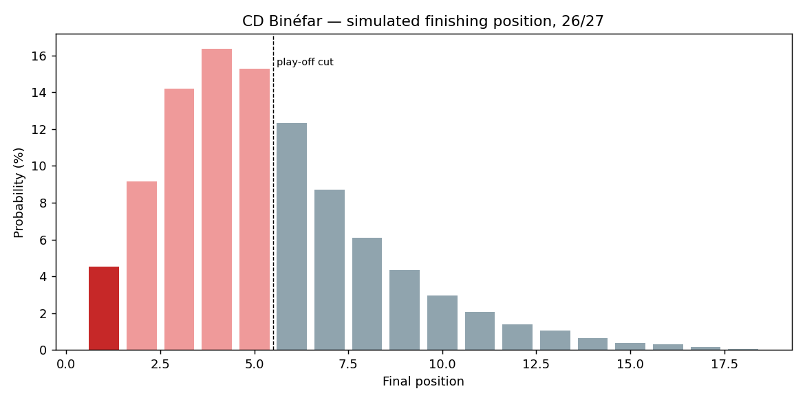
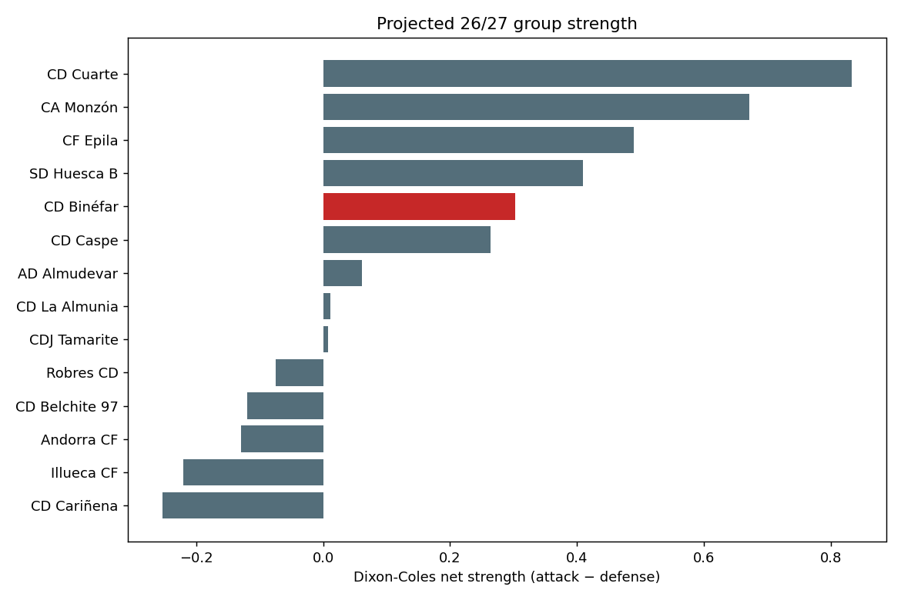
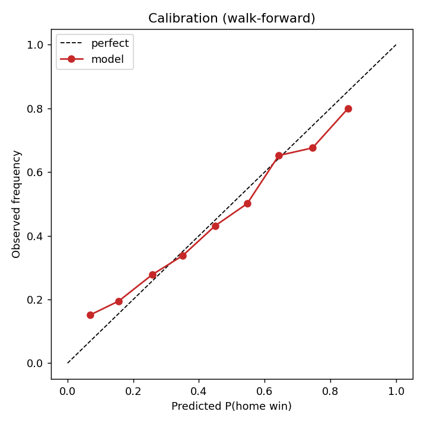

# ⚽ CD Binéfar — Promotion Predictor

**Will [CD Binéfar](https://en.wikipedia.org/wiki/CD_Bin%C3%A9far) be promoted next season?**

An end-to-end, data-driven forecasting pipeline for a specific real club, built
from scraped match data with a properly validated statistical model — not a toy.

```
scrape (Sofascore) → assemble matches → fit Dixon-Coles / Elo ratings
   → Monte-Carlo simulate the season → promotion probability → calibrate
```

> ### 🎯 Headline result (2026-07-14, season 26/27)
> **CD Binéfar has an ~8.0% probability of promotion** to Segunda Federación
> (±0.1% Monte-Carlo SE over 50,000 simulated seasons).
> Mean projected finish: **5.4th of 18**; ~55% chance of reaching the play-off,
> 4.5% of winning the group outright.
>
> See [`models/report.md`](models/report.md) for the full breakdown and plots.

<p align="center">
  
</p>

---

## Who is CD Binéfar, and what does "promotion" mean here?

CD Binéfar (founded 1922, Binéfar, Huesca, Aragón) play in **Tercera Federación,
Group 17** — the **5th tier** of Spanish football and the Aragón regional group.
In 2025-26 they finished **7th of 18** with 48 points (14-6-14, +11 GD).

Promotion from this group to **Segunda Federación** (tier 4) works as:

| Route | Rule |
|---|---|
| **Direct** | Group champion (1st) goes up automatically. |
| **Play-off** | 2nd–5th enter a *territorial* play-off (semis + final). Its winner advances to a **national inter-group phase** for a limited number of extra slots. |

So a team is "promoted" if it **wins the group** *or* **wins the territorial
play-off and then converts the national phase**. The model reproduces exactly
this structure.

## Why this model (and not xG / market values)?

Research into data availability at this level is unambiguous: **no one produces
xG or advanced per-player stats for the Spanish 4th/5th tier** (FBref/Opta stop
at Segunda División), and Transfermarkt lists **empty market values** for
essentially the whole squad. The only rich, reliable signal is **match results
and standings**, which Sofascore covers well.

So the model is built on what genuinely exists — goals and results — using the
methods that are state-of-the-art *for that input*:

* **Dixon-Coles bivariate-goals model** (Dixon & Coles, 1997) with
  **exponential time-decay** (recent matches weighted more) and **L2 shrinkage**
  toward league average (handles small samples / churny lower-league squads).
  Fitted by maximum likelihood over **2,860 matches across 9 seasons**.
* **Elo** with margin-of-victory scaling as an independent sanity baseline.
* **Monte-Carlo season simulation**: sample every fixture's scoreline from the
  fitted distribution, award points, rank by *points → goal difference → goals
  for*, then resolve direct promotion + a simulated territorial play-off bracket.

The squad is still scraped from Transfermarkt (names/positions/ages) for
completeness, and the value→strength hook is implemented and ready for the day
priced players exist — it simply finds nothing to use at tier 5 today.

## Is it any good? (Out-of-sample validation)

The model is validated **walk-forward** (train only on the past — no leakage),
scoring ~2,400 matches it never saw at fit time:

| Metric | Model | Baseline (base rates) |
|---|---|---|
| Log-loss | **1.034** | 1.083 |
| Brier | **0.621** | 0.656 |
| RPS | **0.209** | — |
| Top-pick accuracy | **47.5%** | — |

It beats the naive baseline on every proper scoring rule and is **well
calibrated** — predicted home-win probabilities of 0.64 occur ~64% of the time
(see `models/calibration.png`). Lower-league football is genuinely hard to
predict, so an 8% promotion probability with honest uncertainty is the point,
not a bug.

<p align="center">
  
  
</p>

## Quick start

```bash
git clone https://github.com/matiasmoram/binefar-promotion-predictor.git
cd binefar-promotion-predictor
python -m venv .venv && source .venv/bin/activate
pip install -e .

# Full pipeline: scrape (cached) → fit → simulate → report + plots
binefar-predict predict

# Reproducible offline run from the bundled data snapshot (no network)
binefar-predict predict --offline

# Just the walk-forward validation
binefar-predict backtest

# Refresh the cached data from Sofascore and rebuild the snapshot
binefar-predict scrape --refresh

# Print the current squad (Transfermarkt)
binefar-predict squad
```

Useful flags: `--sims N` (default 50,000), `--half-life DAYS` (rating memory,
default 365), `--l2 F` (shrinkage strength), `--no-backtest`, `--no-plots`.

Outputs land in `models/`: `prediction.json`, `report.md`, and three PNG plots.

## How it works, module by module

| Module | Responsibility |
|---|---|
| `config.py` | Club/league identifiers, endpoints, promotion rules, tunables. |
| `sofascore.py` | Polite, cached Sofascore API client (browser-TLS impersonation via `curl_cffi` to pass Cloudflare). |
| `data.py` | Parse events → tidy `matches`; standings; project the 26/27 group; offline snapshot. |
| `ratings.py` | `DixonColesModel` (time-weighted, L2-regularized MLE) and `EloModel`. |
| `simulate.py` | Vectorized Monte-Carlo season + territorial play-off bracket → promotion probability. |
| `evaluate.py` | Walk-forward backtest, log-loss / Brier / RPS, calibration, champion backtest. |
| `transfermarkt.py` | Best-effort squad scraper (roster; values usually empty at this tier). |
| `predict.py` | Orchestrates everything; writes `prediction.json`, `report.md`, plots. |
| `cli.py` | `predict` / `scrape` / `backtest` / `squad` subcommands. |

## Key modelling choices & assumptions

* **Rating memory (time decay).** Half-life 365 days: last season carries ~full
  weight, two seasons ago ~half. Captures current strength while using history.
* **Projected 26/27 group.** The official group isn't published while the
  transfer window is open, so it's reconstructed from 25/26: drop the champion
  (promoted) and the bottom three (relegated), keep the other 14, and fill four
  slots with **newcomer placeholders** rated league-average minus a small
  penalty (`NEWCOMER_NET_STRENGTH_PENALTY`, promoted sides tend to be weaker).
  Binéfar's promotion odds are driven mostly by the *returning* strong rivals
  (Cuarte, Monzón, Épila, Caspe, Huesca B), which are all fully rated — so the
  result is robust to the newcomer assumption.
* **Play-off model.** The territorial play-off is simulated explicitly
  (single-match semis + final, home tie to the higher seed). Its winner is
  promoted with probability `NATIONAL_PHASE_CONVERSION` (default 0.40),
  reflecting that the territorial title only earns a shot at the national phase.
* **Tie-breakers.** Points → goal difference → goals for (head-to-head is
  approximated by a random tie-break, standard practice in season simulators).
* **Cold-start of unknown teams.** Any team with no rating history falls back to
  league average (with the newcomer penalty for projected newcomers).

## Limitations & honest caveats

* No xG or player-level performance data exists at this tier — the model can't
  use information nobody collects.
* Market values are empty on Transfermarkt for this squad, so no value-based
  prior is applied (the code path exists for higher-tier reuse).
* The 26/27 group composition and summer transfers are not yet known; newcomers
  are modelled generically.
* Promotion is a rare, high-variance event in a single season — treat the ~8%
  as a calibrated probability, not a point prediction.
* `NATIONAL_PHASE_CONVERSION` is an estimate of a genuinely uncertain conversion
  rate; it's exposed as a tunable and only scales the play-off branch.

## Data sources

* **Sofascore** unofficial API — match results & standings (team `263819`,
  tournament `11366`, tier-5 Group 17). Primary feed.
* **Transfermarkt** (club `21551`) — squad roster (best-effort).
* Cross-checks during research: Wikipedia (ES/EN), RFAF/PNFG, resultados-futbol,
  BeSoccer.

All raw responses are cached under `data/raw/`; a reproducible snapshot of the
assembled dataset lives at `data/processed/snapshot_25_26.json`.

## Methodology references

Dixon & Coles (1997), *Modelling Association Football Scores*; Karlis &
Ntzoufras (2003), *Bivariate Poisson models*; Baio & Blangiardo (2010),
*Bayesian hierarchical model for football*; plus standard Elo / Monte-Carlo
season-simulation and probabilistic-scoring (Brier, log-loss, RPS) literature.

## Tests

```bash
pip install pytest && pytest -q      # 16 tests: ratings, simulation, metrics
```

---

*Built as an end-to-end demonstration: real club, real scraped data, a validated
model, and an honest, calibrated answer. Licensed MIT.*
