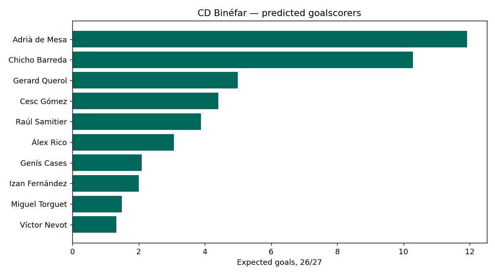
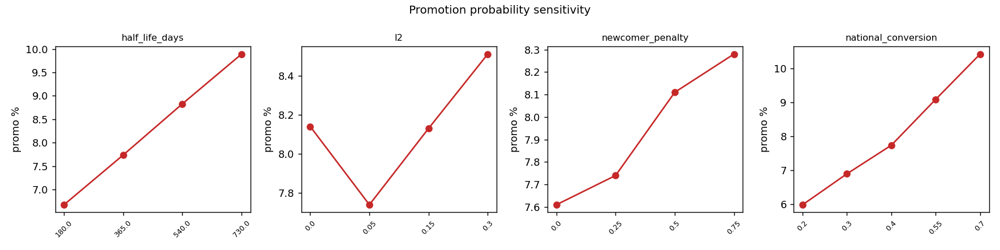

# ⚽ CD Binéfar — Promotion & Goalscorer Predictor

**Will [CD Binéfar](https://en.wikipedia.org/wiki/CD_Bin%C3%A9far) be promoted next season — and who will score the goals?**

An exhaustive, data-driven forecasting engine for a real 5th-tier Spanish club,
built from multi-source scraped data with validated statistical models — an
ensemble of goals models, a Monte-Carlo season simulator, a Dirichlet-multinomial
goalscorer model, real transfer/promotion handling, and walk-forward validation.

```
scrape (Sofascore + Futbolme + Transfermarkt + Regional Preferente)
   → assemble matches & goals → ensemble of Dixon-Coles / Poisson ratings
   → Monte-Carlo simulate the season → promotion probability (+ ensemble band)
   → Dirichlet-multinomial goalscorer allocation → pichichi race
   → sensitivity analysis + walk-forward calibration
```

> ### 🎯 Headline (2026-07-14, season 26/27)
> **~8% probability of promotion** to Segunda Federación
> (**ensemble range 6.6%–8.9%**; primary-model Monte-Carlo SE ±0.1%, 50k sims).
> Mean projected finish **5.5th of 18**; ~53% chance of reaching the play-off.
> Predicted top scorer: **Adrià de Mesa (~13 goals)**.
>
> Full breakdown & plots: [`models/report.md`](models/report.md).

<p align="center">
  
</p>

---

## What it does (a lot)

| Capability | How |
|---|---|
| **Promotion probability** | Monte-Carlo simulation of the full 34-match season + the real territorial play-off bracket + national-phase conversion. |
| **Model ensemble** | Runs the sim under 4 rating variants (Dixon-Coles at 3 half-lives + independent Poisson) and reports the spread as an honest band. |
| **3 independent ratings** | Dixon-Coles, Elo (MOV-adjusted), and pi-ratings (Constantinou-Fenton) — cross-checked by Spearman rank agreement (0.88–0.97). |
| **Goalscorer prediction** | Dirichlet-multinomial allocation of each team's simulated goals to players, with positional priors, empirical-Bayes shrinkage, and a separate penalty-taker stream. |
| **Pichichi race** | League-wide top-scorer probabilities across every team in the group. |
| **Anytime scorer** | Closed-form per-match scoring probabilities (Poisson thinning). |
| **Signings & new joiners** | Squad matched against the **whole-league** scorer table so incoming players carry their real goal record; newly-**promoted teams** (UD Fraga, CD Brea, Internacional Huesca, Atlético Calatayud) are read live from the Regional Preferente table. |
| **Sensitivity analysis** | Promotion probability vs every judgement-call parameter (rating memory, shrinkage, newcomer penalty, play-off conversion). |
| **Validation** | Walk-forward backtest (log-loss / Brier / RPS) + calibration curve, beating baseline. |

## Who is CD Binéfar & what is "promotion"?

CD Binéfar (founded 1922, Aragón) play in **Tercera Federación Group 17** — the
5th tier. In 2025-26 they finished **7th of 18** (48 pts, +11). Promotion to
**Segunda Federación**: the champion goes up directly; 2nd–5th enter a territorial
play-off whose winner then contests a national phase for extra slots. The model
reproduces this exactly (direct title OR play-off route × national conversion).

## Why goals, not xG or market values?

No one produces xG or advanced player stats for the Spanish 4th/5th tier
(FBref/Opta stop at Segunda División), and Transfermarkt market values are empty
here. So the models are built on the signal that genuinely exists — **match
results and goal incidents** — using the methods that are state-of-the-art for
that input.

### Data note that shaped the goalscorer model
Sofascore records every goal (team totals are exact — Binéfar's 58 goals match
the table), but **names the scorer on only ~26% of goals** at this tier. So we
use **Futbolme's complete goleadores table** for authoritative per-player totals
and use Sofascore incidents only to detect the penalty taker and own goals. The
two sources cross-validate (Chicho & De Mesa both 14; Youssef/Monzón 32).

## Is it any good? (Out-of-sample validation)

Walk-forward, scoring ~2,415 matches the model never saw at fit time:

| Metric | Model | Baseline |
|---|---|---|
| Log-loss | **1.034** | 1.083 |
| Brier | **0.621** | 0.656 |
| RPS | **0.209** | — |
| Top-pick accuracy | **47.5%** | — |

Well-calibrated (predicted 0.64 home-win → observed ~0.64), and the promotion
probability stays inside a tight **6.6–10.5%** band across *all* reasonable
assumptions (see sensitivity plot). Lower-league football is inherently
low-signal, so an ~8% calibrated probability with honest error bars is the goal.

<p align="center">
  
  
</p>
<p align="center">
  
  
</p>

## Quick start

```bash
git clone https://github.com/matiasmoram/binefar-promotion-predictor.git
cd binefar-promotion-predictor
python -m venv .venv && source .venv/bin/activate
pip install -e .

binefar-predict predict              # full pipeline → report + plots
binefar-predict predict --offline    # reproducible run from bundled snapshot
binefar-predict backtest             # walk-forward validation only
binefar-predict squad                # print the squad (Transfermarkt)
binefar-predict scrape --goals       # refresh all cached data incl. goal incidents
```

Flags: `--sims N` (default 50k), `--half-life DAYS`, `--l2 F`,
`--no-goalscorers`, `--no-sensitivity`, `--no-backtest`, `--no-plots`.
Outputs land in `models/`: `prediction.json`, `report.md`, and 5 PNG plots.

## Architecture

| Module | Responsibility |
|---|---|
| `config.py` | Club/league IDs, endpoints, promotion rules, tunables. |
| `sofascore.py` | Cached Sofascore API client (curl_cffi TLS impersonation vs Cloudflare): results, standings, goal incidents. |
| `futbolme.py` | Second source: authoritative goleadores (top-scorer) table. |
| `transfermarkt.py` | Best-effort squad scraper (roster, positions, ages). |
| `data.py` | Parse matches; project the 26/27 group; read **real promoted teams** from Regional Preferente; offline snapshot. |
| `players.py` | Goal-incident scraping, penalty-taker/own-goal extraction, cached league goals. |
| `ratings.py` | `DixonColesModel` (time-weighted, L2, optional independent-Poisson), `EloModel`, `PiRatingModel`. |
| `simulate.py` | Vectorized Monte-Carlo season + territorial play-off bracket → promotion probability + goal distributions. |
| `ensemble.py` | Multi-model promotion probability + cross-model Spearman agreement. |
| `goalscorer.py` | Dirichlet-multinomial goal allocation, penalty stream, squad name-matching, league pichichi. |
| `analysis.py` | Sensitivity analysis + form/venue splits. |
| `evaluate.py` | Walk-forward backtest, log-loss/Brier/RPS, calibration, champion backtest. |
| `predict.py` | Orchestrates everything → `prediction.json`, `report.md`, plots. |
| `cli.py` | `predict` / `scrape` / `backtest` / `squad`. |

## Modelling choices, adopted techniques & assumptions

* **Dixon-Coles with time decay** (Dixon & Coles 1997) — attack/defense per team,
  low-score correction ρ, exponential recency weighting, L2 shrinkage for small
  samples. **Independent-Poisson** variant (ρ=0) and **pi-ratings**
  (Constantinou-Fenton) added after studying `penaltyblog`, ClubElo and the
  pi-ratings literature.
* **Goalscorer model** — `E[player goals] = E[team goals] × player share`, with the
  share drawn from a **Dirichlet-multinomial** (overdispersion), positional-prior
  Dirichlet concentration, empirical-Bayes shrinkage, and a separate penalty
  stream to the designated taker. Handles **new signings** (matched league-wide)
  and churn (positional priors for players with no record).
* **Real new joiners** — the 26/27 group is unpublished mid-window, so we drop the
  promoted champion + relegated three and add the actual promoted teams read from
  the Regional Preferente Aragón table. UD Fraga & CD Brea have Tercera history →
  real ratings; the rest use the newcomer prior.
* **Play-off** — territorial bracket simulated explicitly (single-match semis +
  final, home to higher seed); winner promoted with `NATIONAL_PHASE_CONVERSION`.
* **Tie-breakers** — points → goal difference → goals for.

## Limitations & honest caveats

* No xG / minutes / line-ups exist at this tier; goalscorer shares are the
  identifiable quantity and are shrunk hard.
* Goleadores are single-season (25/26) — authoritative but noisy per player.
* 26/27 squad on Transfermarkt still mirrors 25/26 (window open); confirmed
  signings from outside the group get positional priors.
* Promotion is a rare, high-variance event — treat ~8% as a calibrated
  probability, not a point prediction.

## Data sources

Sofascore (results, standings, goal incidents; team `263819`, tournament
`11366`), Futbolme (goleadores, tournament `3071`), Transfermarkt (squad,
`21551`), Regional Preferente Aragón (promoted teams, tournament `19257`).
Raw responses cached in `data/raw/`; assembled snapshots in `data/processed/`.

## Methodology references

Dixon & Coles (1997); Karlis & Ntzoufras (2003, bivariate Poisson); Baio &
Blangiardo (2010, Bayesian hierarchical); Constantinou & Fenton (2013,
pi-ratings); Dirichlet-multinomial allocation & empirical-Bayes shrinkage for
scorer shares; standard Elo / Monte-Carlo / Brier–log-loss–RPS literature.
Open-source studied: `penaltyblog`, `soccerdata`, ClubElo.

## Tests

```bash
pip install pytest && pytest -q      # 25 tests: ratings, simulation, goalscorer, ensemble, metrics
```

---

*Real club, multi-source scraped data, an ensemble of validated models, a
goalscorer model, and an honest, calibrated answer. Licensed MIT.*
